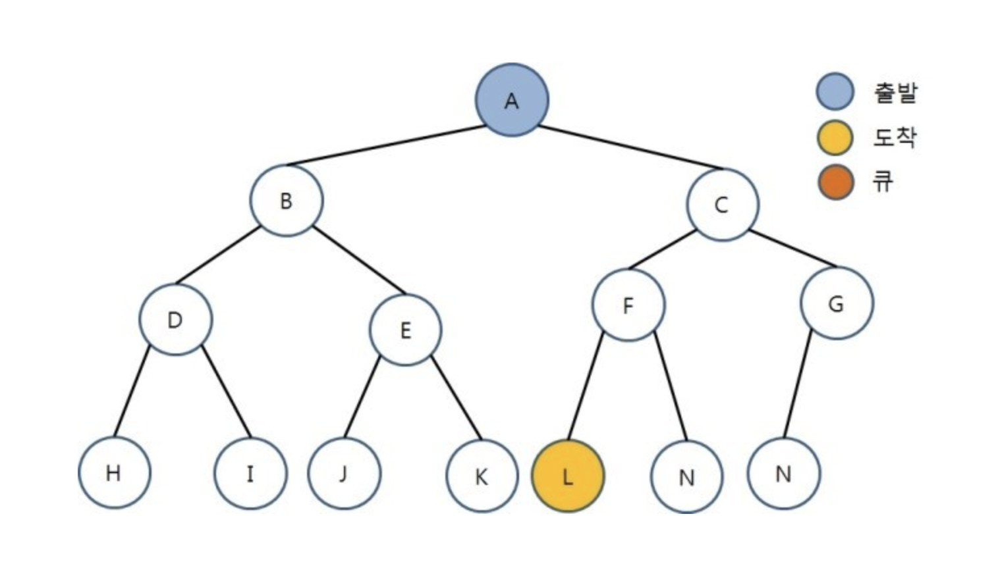

# LeetCode

## 목차
- [Sliding Window](#sliding-window)
- [Longest Common Substring](#longest-common-substring)
- [Two Pointer Technique](#two-pointer-technique)
- [Horizontal and Vertical Scanning](#horizontal-and-vertical-scanning)
- [Backtracking](#backtracking)
- [Depth and Breath First Search](#depth-and-breath-first-search)
- [Binary Search](#binary-search)
- [Dynamic Programming](#dynamic-programming)
- [Binary Tree Traversal](#binary-tree-traversal)
- [Level Order Traversal](#level-order-traversal)
- [AVL Binary Tree](#avl-binary-tree)
- [Divide And Conquer](#divide-and-conquer)

### 알고리즘 정리

보통은 README파일을 영어로 작성하는 노력을 하는 편이나, 알고리즘 정리 부분은 한글로 작성한다. 이는 스스로의 알고리즘 공부를 위한 것이며 나중에 다시 보는 일을 대비하기 위해서이다. 아무래도 영어는 읽는 노력이 필요하지만 한글은 그냥 읽으면 그만이라서 편하니까. 실제 코드를 보면 주석처리 된 부분들이 있는데, 이는 문제에 어울리는 알고리즘 정답을 확인하기 전에 혼자 풀어보았으나 시간복잡도나 메모리 소비량이 너무 많은 경우의 코드이다. 그러한 상황을 줄이기 위해 알고리즘을 이용한 풀이에 익숙해지고 숙지할 수 있는 연습이 필요하다.

### Sliding Window

위키피디아에 따르면 네트워크상에서 패킷의 흐름을 제어하기 위한 용도로 사용된다고 한다. 제목과 같이 양옆으로 밀어서 여는 방식의 창문처럼 특정 길이의 그룹을 한칸씩 옆으로 옮기면서 작업을 실행하는 알고리즘을 말한다. Leetcode에 있는 [문제](https://leetcode.com/problems/longest-substring-without-repeating-characters/)를 간결하게 만들어서 예로 들겠다.
```
String S = 'aabcecda' 라는 문자열이 있을 때, 같은 문자가 중복되어 들어가 있지 않은 substring의 최대 길이를 찾으라.
```
라는 문제가 있다면, 사실 가장 흔하게 생각할 수 있는 방법은 하나씩 다 해보는 것이다. 이를 무차별 대입(Brute Force)방식이라고 하는데 간단히 말하자면 될때까지 for루프를 돌리는 것이다. 이럴경우 문자열의 길이에 따라 O(n<sup>3</sup>)의 시간복잡도를 가진다. 실제로 이 프로젝트의 위의 문제에서 처음에 그렇게 풀었는데, 코드가 길어지는 건 물론이고 시간이 몇배는 더 걸렸다. 슬라이딩 윈도우를 사용할 경우 루프는 한번이면 된다. 코드는 [깃허브](https://github.com/ninanung/leetcode/blob/master/longest_substring_without_repeating_characters.js)에서 확인하시고, 간단히 원리를 설명하면,
```
a  a  b  c  e  c  d  a
[]
a  a  b  c  e  c  d  a
   []
a  a  b  c  e  c  d  a
   [--]
a  a  b  c  e  c  d  a
   [-----]
a  a  b  c  e  c  d  a
   [--------]
a  a  b  c  e  c  d  a
            [--]
a  a  b  c  e  c  d  a
            [-----]
a  a  b  c  e  c  d  a
            [--------]
```
와 같은 형태로 중복된 것이 있을경우 창문의 길이를 줄이면서 조사하는 것이다. 결과를 보면 최대 길이는 4가 된다. 2가지 경우의 수가 나오지만 어쨌든 둘다 길이는 4이다. 작성된 코드에서는 뒤에있는 `[`괄호를 `start`변수로 설정하고 탐색중인 글자의 자릿수에서 `start`를 뺀 숫자를 기준으로 최대 길이를 계산하는 방식을 사용한다. 이 문제에 대한 시간복잡도는 O(2n)으로 무차별 대입 방식과 비교하면, n이 커질수록 속도의 차이는 더 커진다. 만약 후에 이와 비슷한 방식의 문제가 나온다면 우선 가능한지 시도해 보는 것도 좋다.
> 시간복잡도 : O(2n)

### Longest Common Substring

이걸 알고리즘이라고 하기는 뭐하지만, 일단 적어본다. 사용될만한 부분을 생각해 보자면, 검색기능을 구현할 때 substring이 가장 많은 결과를 보여주는 방식으로 쓸 수도 있을 것 같다. 주된 목적은 두개의 문자열이 가지고 있는 가장 긴 동일 부분 문자열을 찾는 것이다. 두개의 문자열을 탐색하기 때문에 기본적으로 시간복잡도는 두 문자열의 길이의 곱인 O(n x m)이다. 기본적인 방법은 두번의 for문을 이용해서 모든 문자열을 탐색하며, 동일한 문자일 경우 임의의 이중배열에 숫자를 표기하여 이전자리에 해당하는 이중배열의 숫자가 0이 아닐경우 +1을 해가면서 결국 가장 숫자가 높은 자리까지의 부분 문자열이 가장 긴 동일 문자열이 되는 것이다. 말로 설명하는 것 보다는 코드를 확인하면 좋은데 간단히는 이러하다.
```javascript
function longestCommonSubstring = (s, n) {
    let substring = '';
    let max = 0;
    let table = makeTable(s, n); //문자열 s와 n을 이용해서 임의의 이중배열을 만드는 가상의 함수
    for(let i = 0; i < s.length; i++) {
        for(let j = 0; j < n.length; j++) {
            if(s[i] === n[j]) {
                if(i === 0 || j === 0) {
                    table[i][j] = 1;
                    if(max === 0) {
                        substring = s[i]
                        max = 1;
                    }
                } else {
                    table[i][j] = table[i - 1][j - 1] + 1;
                    const sliced = s.slice(i + 1 - table[i][j], i + 1)
                    if(sliced.length > max) {
                        substring = sliced
                        max = substring.length
                    }
                }
            }
        }
    }
    return substring;
}
```
문제는 내가 이 방법을 이용해서 [longest-palindromic-substring](https://leetcode.com/problems/longest-palindromic-substring/)문제를 풀려고 했다는 것인데, 특정 문자열과 그 문자열의 반대순서의 부분 문자열은 좌우대칭일 가능성이 높다는 생각 까지는 좋았으나, 결과로 나온 부분 문자열이 꼭 좌우대칭이라는 보장이 없기때문에 좌우대칭인지 아닌지를 판단하는 코드가 들어가면 시간이 더 늘어나는 바람에 망했다.
> 시간복잡도 : O(n x m)

### Two Pointer Technique

오름차순으로 정렬된 배열 y가 있을 때, 해당 배열에서 두개의 요소를 뽑아 합하면 특정 값 x가 된다고 할때, 요소 두개를 어떻게 구할까? 라는 문제에 대한 해답이 되는 알고리즘이다. 가장 간단하게 생각나는 방법은 당연히 무차별 대입방법으로, 하나의 요소에 대한 다른 요소의 합을 전부 구해봐야 하기 때문에 두번의 루프를 돌리려서 시간복잡도는 O(n<sup>2</sup>)이 된다. 하지만 이 방법을 사용하면 배열의 양쪽 끝에서 시작하여 중심으로 점점 움직이며 탐색하므로 한번의 루프면 되므로 시간복잡도는 O(n)이된다. 원리에 대해서 예를 들자면,
```
y = [10, 20, 30, 40, 60, 70]
x = 60

left = 0, right = 5, y[left] + y[right] = 80
left = 0, right = 4, y[left] + y[right] = 70
left = 0, right = 3, y[left] + y[right] = 50
left = 1, right = 3, y[left] + y[right] = 60
```
이러한 방식으로 움직이게 된다. 두 요소의 합이 x보다 크면 right를 줄이고 작으면 left를 늘리면서 적절한 값을 찾는다.  
  
[container-with-most-water](https://leetcode.com/problems/container-with-most-water/)문제를 위해 위와 비슷한 방식을 사용했다. 처음에는 Sliding Window방식으로 탐색하면 되지 않을까 잠깐 생각했으나 여러개의 요소가 아니라 두개의 요소를 뽑아서 비교하는 방식이기 때문에 맞을 것 같지 않아서 결국 이 방법을 찾았다.
```javascript
var maxArea = function(height) {
    let left = 0;
    let right = height.length -1;
    let max = 0;
    while(right - left > 0) {
        if(height[left] < height[right]) {
            max = (right - left) *  height[left] > max ? (right - left) *  height[left] : max
            left++;
        } else {
            max = (right - left) *  height[right] > max ? (right - left) *  height[right] : max
            right--;
        }
    }
    return max;
};
```
코드는 이러한데, 물을 가두기 위한 기둥의 높이가 더 낮은 쪽의 포인트를 옮겨야 한다. 이유는, 높은쪽을 옮기는 것 보다는 낮은쪽을 옮여야 커질 가능성이 생긴다는 것이다. 높은쪽을 옮겨봐야 거리가 좁혀지기 때문에 물의 양이 작아질 수밖에 없지만 낮은쪽을 옮기면 더 커질 가능성이 생긴다는 원리. 나는 이걸 머릿속으로는 이해했지만 설명하라고 하면 어떻게 설명해야 할지 모르겠다. 이 문제의 시간복잡도는, 위에서 설명한 것과 같다.
> 시간복잡도 : O(n)

### Horizontal and Vertical Scanning

이 알고리즘은 보안과 관련된 영역에서 IP와 Port에 대한 탐색을 할때도 사용되는 모양이다. horizomtal의 경우에는 하나의 Port에 대한 여러개의 IP를, vertical의 경우에는 하나의 IP에 대한 여러개의 Port를 탐색하는 방식이라고 한다. 이는 다중배열과 유사한 구조라면 어디에도 적용하여 사용될 수 있는 것으로 보인다. [Longest Common Predix](https://leetcode.com/problems/longest-common-prefix/submissions/)의 문제를 푸는데 사용하였다.
```
Array x = ["string", "start], "star"]이 있을 때 요소들의 공통적인 접두 부분문자열(prefix)을 구하라
```
라는 문제가 있다면, 딱 보기에도 정답은 "st"이지만 어떻게 탐색할지가 문제가 된다. 여기에서 두가지 탐색 방식을 사용할 수 있다. horizontal은 문자열들을 수평적으로 비교하여, 처음 두개를 비교하여 나온 prefix로 다음 문자열과 비교하고, 그렇게 나온 predix로 또 다음문자열과 비교하는 방식으로 수평적인 이동을 통해 탐색한다. vertical방식은 첫번째 문자열을 기준으로 모든 문자열에 대한 첫번째 글자부터 비교해가는 방식이다. 모든 문자열의 첫번째 -> 두번째 -> 세번째 문자를 비교하기 때문에 수평이 아닌 수직적으로 놓고 비교한다. 시간복잡도는 O(S)인데 여기서 S는 배열의 모든 문자열들의 문자수를 전부 합한 것이다.
> 시간복잡도 : O(S)

### Backtracking

[BFS와 DFS알고리즘](#depth-and-breath-first-search)을 모른다면 먼저 확인한 후에 이 알고리즘을 보는게 순서상 맞을 것 같다. [letter-combinations-of-a-phone-number](https://leetcode.com/problems/letter-combinations-of-a-phone-number/)문제를 풀기위해 사용하였으나, 엄밀히 말하자면 해당 문제는 이 알고리즘에 어울린다고 말할 수 없다. backtracking 알고리즘은 트리를 탐색할 때 특정 가지가 탐색할 가치가 없다(조건에 맞지 않음)라고 판단되면, 뒤로 돌아가서 다른 가지를 탐색함으로써 시간낭비를 줄일 수 있다. 일종의 깊이우선탐색의 상위방식처럼 보이기도 한다. 그런데 해당 문제는 어쨌든 모든 트리를 탐색하여 결과를 반환해야 하기 때문에 단순한 트리 탐색 방식을 사용해도 무방해 보인다. 어찌됐든, 재귀(recursive)방식을 사용하여 트리를 탐색하는 것이 기본이 되며, 조건에 맞는 노드가 있을 경우 스택에 넣었다가 조건이 맞지 않으면 빼어가며 진행하게 된다.  
코드는 따로 올리지 않을 것이고 궁금하면 찾아보자. 하지만 시간복잡도에 대한 얘기는 해야 할 것 같은데, 전화번호에 해당하는 글자들의 수를 기준으로 시간복잡도는 O(3<sup>n</sup> x 4<sup>m</sup>)이 된다. 여기서 `n`은 3개의 알파벳을 가지는 전화번호의 수이며 `m`은 4개의 알파벳을 가지는 전화번호의 수이다. backtracking 알고리즘의 경우에도 최악의 경우에는 모든 트리를 탐색해야 하므로 몇개의 가지를 탐색하느냐에 따라 시간복잡도는 제곱만큼 늘어나는 경우가 많다.
> 시간복잡도 : 인용한 문제의 경우 O(3<sup>n</sup> x 4<sup>m</sup>)

### Depth and Breath First Search

한글로는 깊이우선탐색, 넓이우선탐색이라고 부른다. backtracking과 마찬가지로 트리를 탐색하는 방식의 하나이다. 그 이름에서 짐작할 수 있듯이, 각각 트리의 깊이를 기준으로 탐색할지, 아니면 넓이를 기준으로 탐색할지의 차이이다. 이 차이를 만드는 건 큐 방식을 사용하느냐 스텍 방식을 사용하느냐의 차이이다. 그림을 보고 생각하도록 하자.
  
이러한 트리가 있을경우, 노드`L`을 찾아야 한다고 할 때 깊이우선방식은 아래와 같은 순서대로 진행한다.
```
stack = A -> [A]
stack = C, B -> [C, B] -> A
stack = D, E ->[C, E, D] -> B
stack = H, I -> [C, E, I, H] -> D
stack = [C, E, I] -> H
stack = [C, E] -> I
stack = J, K -> [C, K, J] -> E
...
stack = G, F -> [G, F] -> C
stack = L, N -> [G, N, L] -> F
stack = [G, N] -> L
Found L!
```
편의를 위해 왼쪽의 노드가 스텍으로 들어가는 것 처럼 그렸지만 사실 스텍의 구조상 나가고 들어오는 방향은 같아야 한다. 흔히들 스텍을 FILO(first in last out)이라고 하는게 그러한 이유다. 이러한 구조는 자식노드의 자식노드, 그 자식노드의 자식노드, 그 자식노드의 자식노드를 계속해서 탐색하면서 점점 트리의 깊이 들어갔다가, 반대쪽의 트리로 다시 깊이 들어가면서 탐색한다. 따라서 깊이우선 탐색이라는 이름이 붙었다.  
  
넓이우선의 경우에는 다른 방식으로 트리를 탐색한다
```
queue = A -> [A]
queue = B, C -> [C, B] -> A
queue = D, E -> [E, D ,C] -> B
queue = F, G -> [G, F, E, D] -> C
queue = H, I -> [I, H, G, F, E] -> D
...
queue = [N, L] -> K
queue = [N] -> L
Found L!
```
이번에는 왼쪽으로 들어가고 오른쪽으로 나오는게 맞다. 큐는 FIFO(first in first out)의 구조를 가지기 때문에 노드의 자식노드를 전부 탐색하고 그 자식 노드들의 자식노드들을 또 전부 탐색하면서 진행한다. 따라서 트리의 층층이 탐색하며 나가므로 넓이우선 탐색이라는 이름이 붙었다. 두개의 알고리즘중에서 뭐가 우월하다! 라고 말하기는 힘들며 상황에 따라 사용하는 것이 옳다.

### Binary Search

한글로는 이진탐색이라고 부른다. 정렬된 데이터를 토대로 그중에 target과 같은 값을 찾는 문제에서 활용할 수 있다. 단점은, 무조건 정렬된 데이터를 기준으로 해야 한다는 것이다. 이진탐색의 기본 원리가 배열의 중간 요소와 target을 비교해나가며 점점 범위를 좁혀가는 방식이기 때문에 배열의 중간을 기준으로 앞뒤의 요소들을 특정할 수 있어야 한다. 원리는 이미 설명한 것 처럼 아주 간단하다. 예를 들어보자
```
Array = [1, 3, 4, 5, 7, 9, 11, 12, 15]라는 배열이 있을 때 "4"를 찾으시오
```
라는 문제가 있다면 우선 배열의 첫 요소의 index와 끝 index를 합해서 2로 나눈다. 결과는 4가 나오는데 `Array[4]`의 값은 7이다. 이를 기준으로 target인 4와 비교하면, 7은 4보다 크므로 찾아야 할 값은 중심을 기준으로 배열의 왼쪽에 있음을 알 수 있다. 그러면 배열의 오른쪽과 중심 요소는 무시하고 다시 같은 방식으로 탐색을 시작한다. 역시나 첫 요소와 끝 요소를 합해서 나누면 1.5이지만 소숫점 아래는 버리고 계산한다. `Array[1]`은 3이다. target인 4보다 작다. 이번에는 오른쪽 요소들을 남기고 다른 요소들은 무시한다. 이번 배열의 첫 요소와 끝 요소는 2와 3. 합해서 나누고 소숫점을 버리면 2가 된다. `Array[2]`는 4이다. 드디어 찾는 값과 같은 값을 찾았다.

이처럼 이진탐색은 어떤 기준을 잡고 그 기준을 통해 요소를 탐색하기 때문에, Linear Scan방식과 달리 모든 요소를 전부 찾을 필요가 없다. Linear Scan방식의 시간복잡도는 O(n)이다. 최악의 경우 모든 요소를 확인해야 하기 때문이다. 하지만 이진탐색은 최악의 경우라도 모든 요소를 탐색할 필요가 없다. 따라서 시간복잡도는 log로 잡을 수 있다. 결과는 O(log n)이다.
> 시간복잡도 : 기본적인 이진탐색일 경우 O(log n)

### Dynamic Programming

동적 계획법이라고도 한다. 간단한 원리는 큰 하나의 문제를 여러개로 나누어 풀어내는 방식을 말한다. 이 알고리즘을 사용하기 위해서는 두가지 조건을 만족해야 하는데,

1. 큰 문제를 작은 문제로 나눌 수 있어야 한다.
2. 작은 문제에서 구한 값은 큰 문제에 적용할 때도 동일하다.

말이 좀 어려울 수 있지만, 결국은 큰 문제들을 작은 문제들로 나눈 후 작은 문제들을 풀어서 구한 값을 큰 문제에 적용하여 해결할 수 있어야 한다는 것이다. 이것에서 오는 장점은, 같은 문제를 여러번 풀 필요 없이 작은 문제를 풀어서 구한 값을 그대로 사용하면 된다는 것이다. 이에 대한 예를 들만한 것으로 피보나치 수열이 있다. 피보나치 수열은 이전 두개의 값을 더한 값이 자신이 되고 또 다음값도 같은 구조를 반복하는 수열을 말한다. 따라서 `Array = [a1, a2, a3, a4, a5, a6]` 가 있을 때 `a1 + a2 = a3, a2 + a3 = a4, a3 + a4 = a5...` 식으로 구성된다. 이를 보면 알겠지만, 하나의 요소가 여러번 사용되고 있다. 이를 단순하게 재귀적인 방법으로 해결하면
```javascript
// x번째의 수를 구하는 함수
function recursive(x) {
    if(x === 1 || x === 2) return 1;
    return recursive(x - 1) + recursive(x - 2);
}
```
이처럼 된다. 하지만 이는 하나의 `recursive`함수가 두개의 함수를 재귀적으로 불러오고, 이미 구한 값을 위해 또 다시 함수를 구해야 하기 때문에 시간복잡도가 O(2<sup>n</sup>)가 된다. 이는 상당히 느린 것으로 50번째 수를 구하는 것 만으로도 상당한 시간을 소모하게 된다. 여기에 동적 프로그래밍을 사용하게 되면 구한 값을 저장하는 방식으로 사용할 수 있다. 함수를 조금만 바꿔보자.
```javascript
const array = [];

function recursive(x) {
    if(array[x - 1]) return array[x - 1];
    if(x === 1) array[0] = 1;
    if(x === 2) array[1] = 1; 
    array[x - 1] = recursive(x - 1) + recursive(x - 2);
    return array[x - 1];
}
```
복잡해 보이지만 사실 간단하다. 그냥 결과값을 배열 `array`에 저장하도록 했고 만약 특정 위치에 있는 값을 이미 구한적이 있다면 새로 구하는 대신에 배열에서 값을 가져다가 쓰도록 변경했다. 이렇게 하면 이미 구한 값을 또 구할 필요가 없어지기 때문에 시간복잡도도 O(2<sup>n</sup>)이 아닌 O(n)이 된다. 어렵게 설명한 것 같지만, 동적 프로그래밍에서는 한가지만 기억하면 된다. "한번 구한 값은 또 구하지 않는다." 이것이 핵심 내용이라고 할 수 있다.

### Binary Tree Traversal

이진트리 순회알고리즘에 대한 얘기를 해보고자 한다. 흔히들 얘기하는 pre-order, in-order, post-order가 여기에 속하는데 우리말로는 전위, 중위, 후위 순회라고 부른다. 쉽게 말하면 "해당 node의 값을 언제 읽을것인가?"에 대한 규칙이다. 이름 그대로 먼저, 중간에, 나중에 읽는 방식이다. 이해하기 쉬운만큼 알고리즘으로 구현하기도 쉬운데, 몇가지 방법들 중 가장 대표적인 재귀적 탐색으로 설명하겠다.
```javascript
// root는 트리에서 가장 위에 있는 node를 기리키고 있다.
/* root = {
    val: value,
    left: null,
    right: null
}*/
// result는 순회한 node의 val을 저장해서 순회 순서를 알 수 있는 결과값이다.
function order(root, result=[]) {
    if(root === null) return []; // 방문한 node가 null이면 빈 배열을 리턴한다. root가 처음부터 null일 경우 필요하지만 빈 배열에 큰 의미는 없다.
    result.push(root.val); // pre-order의 경우 여기에서 노드의 값을 읽는다.
    order(root.left, result);
    result.push(root.val); // in-order의 경우 여기에서 노드의 값을 읽는다.
    order(root.right, result);
    result.push(root.val); // post-order의 경우 여기에서 노드의 값을 읽는다.
    return result;
}
```
딱 보면 알겠지만 코드 자체부터가 아주 짧고 간단하다. 그냥 왼쪽 오른쪽 노드에 대해서 재귀적으로 함수를 호출해주면 된다. 값을 언제 읽는지에 따라서 값을 읽는 코드를 위치시키기만 하면 된다. 이 알고리즘의 경우 탐색이 아닌 순회이기 때문에 기본적으로 모든 노드를 방문하는 걸 목적으로 한다. 따라서 어떤 알고리즘을 쓰던지(재귀적인 방법 말고 스택을 쓰는 방법도 있다.) 모든 n개의 노드를 확인해야 하므로 시간복잡도는 O(n)이다.
>  시간복잡도 : O(n)

### Level Order Traversal

한국어로 딱히 불리는 단어는 없고 그냥 레벨순회라고 불리는 모양이다. 원래는 위에서 2진트리 순회를 설명할때 같이 했어야 하지만 조금 방식이 다르므로 따로 설명한다. 사실 새로울 것은 없다. [BFS와 DFS알고리즘](#depth-and-breath-first-search)에서 설명한 BFS즉 넓이우선 탐색과 같은 방식이기 때문이다. 그렇다 레벨순회는 층에서 층으로 순회하는 방식을 말한다. 레벨이라는 것은 층을 말하는 것이다. 인터넷을 좀 찾아봤는데 BFS와 레벨순회의 차이를 명확하게 설명한 경우가 없었다. 일단 같은 방식이라고 생각하는게 맞는 것 같다. 코드를 보자
```javascript
var levelOrder = function(root) {
    const queue = [];
    const result = [];
    queue.push(root);
    while(queue.length > 0) {
        const length = queue.length;
        for(let count = 0; count < length; count++) {
            const node = queue.shift();
            result.push(node.val);
            if(node.left) queue.push(node.left);
            if(node.right) queue.push(node.right);
        }
    }
    return result;
};
```
해당 코드는 노드들을 순회하면서 value값을 배열`result`에 순서대로 저장해서 어떤 순서로 순회하는지 보여주는 코드이다. 딱 봐도 다른 이진트리 순회들이 재귀적인 방식을 사용하는 것에 비해 queue와 `while`을 써서 층층이 방문하는 것을 알 수 있다. 왜 큐를 사용하느냐? 그건 BFS에서 설명했으니 그 글을 참고해 보자. 레벨순회로 말할 것 같으면 시간복잡도는 당연히 O(n)이다. 방식은 다르지만 모든 노드를 방문한다는 사실은 같기 때문이다.
> 시간복잡도 : O(n)

### AVL Binary Tree

이 노드에 대한 설명은 조금 어려울 수 있는데, 위키의 말을 빌리자면 균형잡힌 이진탐색트리를 말한다. 여기서 균형잡혔다고 하는 것은 특정 이진트리 T가 있다고 할때, 임의의 노드n을 기준으로 왼쪽 노드 x와 오른쪽 노드 y의 높이차이가 1이하여야 한다. 이러한 성질은 T의 모든 모드들에서 만족해야 하며, 이러한 상태를 `height-balance property`를 만족한다고 한다. 다만 단순히 높이 차이를 유지하는 것 뿐만 아니라. 임의의 노드 n을 기준으로 x노드의 값은 n의 값보다 작아야하고 y노드의 값은 n의 값보다 커야한다. 여기까지 보면 헷갈리겠지만, 사실 이를 만족하는 트리를 보면 이마를 탁 치게된다.
  
이 트리는 기준을 만족하고

  
이 트리는 만족하지 않는다.

  
AVL트리에는 한가지 더 재미있는 특성이 있는데, 값을 넣거나 뺄때 `rotation`을 사용한다는 것이다. 쉽게 말해서 회전하면서 트리를 구현한다는 말이다. 이 부분에 대해서도 설명을 하고는 싶으나 너무 길어질 것 같아서 따로 gist를 작성할 생각이다. [링크](https://gist.github.com/ninanung/57d9d936b891efc03783063750a21654)
> 탐색 시간복잡도 : O(log n)

### Divide And Conquer

분할정복 알고리즘이라고도 부른다. 폰 노이만의 Merge Sort알고리즘과 비슷하다고 볼 수 있다. 사실 이름이 모든걸 설명하는 정직한 알고리즘이다. 만약 오름차순으로 정렬된 배열들의 배열, 즉 이중배열이 있다고 생각해 보자. 그리고 그 배열들을 역시나 오름차순으로 병합해야 한다고 생각해 보자. 가장 먼저 떠오르는 방법은 loop를 통해 하나씩 sorting하고 병합하는 것이다. 허나 하나씩 병합할 때 마다 읽어야 하는 요소들이 길어지기 때문에 시간복잡도가 말도 안되게 늘어난다. 이러한 상황에서 사용할 수 있는 것이 바로 분할정복 알고리즘이다.

우선 예를 보도록 하자.

  
하나의 큰 배열을 두개의 배열씩 병합하고, 병합된 배열을 다시 병합하는 방식으로 진행되고 있다. 이렇게 하면 순서대로 하나씩 병합하는 동작에 비해 이미 읽었던 요소들을 다시 읽는 수를 확실하게 줄일 수 있다. 나는 해당 알고리즘이 사용된 문제에서 새로 병합된 배열을 queue에 넣는 방식을 사용했다. 그렇게 하면 순서대로 분할하여 병합하는 것이 가능해진다. 참고해도 좋을 것 같다.